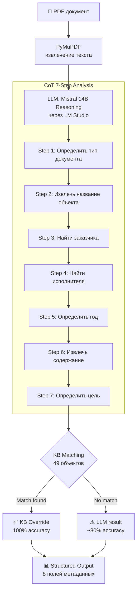

# PD Document Analyzer — AI-Powered 8-Field Extraction with CoT Reasoning

> **Problem:** Классификация и извлечение метаданных из PDF проектной документации (строительство) вручную — рутинная работа: определить тип документа, заказчика, исполнителя, год, объект, содержание, цель. На 100 документов уходят дни.
>
> **Solution:** LLM-анализатор с 7-шаговым Chain-of-Thought reasoning и Knowledge Base на 49 типов объектов капитального строительства. CoT-fallback архитектура: сначала LLM-анализ, затем KB-matching для верификации и повышения accuracy.
>
> **Outcome:** Accuracy выросла с 30% (V5) до 80% (V6) на выборке из 94 реальных документов. На known documents из KB — 100% точность.

### Key Metrics
| Metric | Value |
|---|---|
| Accuracy V5 | 30% |
| Accuracy V6 | 80% |
| Прирост | +50 п.п. (×2.67) |
| Тестовая выборка | 94 документа |
| Объектов в Knowledge Base | 49 |
| Known documents accuracy | 100% |
| Извлекаемых полей | 8 (объект, документ, заказчик, исполнитель, год, тип, содержание, цель) |
| LLM | Mistral 14B Reasoning (LM Studio, локально) |

### CoT Pipeline Architecture



### Tech Stack


> **Production deployment:** any OpenAI-compatible endpoint (Groq, OpenAI, NVIDIA NIM). LM Studio used for local development and offline mode.

### 📋 Описание проекта
📄 [Подробное описание проекта (PDF)](https://drive.google.com/file/d/1YGpM1XyP46CPEgGNF9KhXnWoPx_ltfm3/view?usp=sharing)

---

## 🚀 Быстрый старт & Live Demo

🔥 **Live Demo:** Анализатор развернут онлайн и работает на базе NVIDIA API (модель Mistral 14B Reasoning). Попробуйте загрузить PDF по ссылке: [http://5.101.119.90:5006/](http://5.101.119.90:5006/)

### Локальная установка

### 1. Клонировать
```bash
git clone git@github.com:14Segun88/pd-document-analyzer.git
cd pd-document-analyzer
```

### 2. Установить зависимости
```bash
pip install flask pymupdf python-docx
```

### 3. Запустить LM Studio
Запустите LM Studio локально с моделью `Mistral 14B Reasoning`.
Обеспечьте доступность сервера по адресу из `.env` файла.
```bash
cp .env.example .env
```

### 4. Запустить сервер
```bash
cd v6 && python web_server_v6.py
# Сервер на http://localhost:5006
```

---

## 📂 Структура проекта

```
pd-document-analyzer/
├── README.md
├── .env.example
├── .gitignore
├── v6/                          # Текущая версия (V6)
│   ├── web_app_v6_cot_fallback.py   # Основной анализатор (CoT + KB fallback)
│   ├── web_server_v6.py             # Flask-сервер
│   └── kb/                          # Knowledge Base
│       ├── knowledge_base.json      # 49 объектов + метаданные
│       └── remove_kb_duplicates.py  # Утилита дедупликации KB
├── benchmarks/                  # Бенчмарки и скоринг
│   ├── benchmark_v6_all_documents.py
│   ├── run_benchmark_v6.py
│   ├── run_benchmark_fair.py
│   ├── semantic_scorer.py
│   ├── cross_model_scorer.py
│   └── results/                 # Результаты V5 vs V6
│       ├── V6_FINAL_REPORT.md
│       └── v6_benchmark_results.json
├── scripts/                     # Вспомогательные скрипты
│   ├── start_v6.sh
│   └── cleanup.sh
├── docs/                        # Документация
│   ├── BLOCK_DIAGRAM_v6.md
│   ├── README_V6.md
│   ├── START_INSTRUCTIONS.md
│   └── ...
└── archive/                     # Предыдущие версии (V2–V5)
```

---

## 📜 Лицензия

Проприетарное ПО. Все права защищены.
